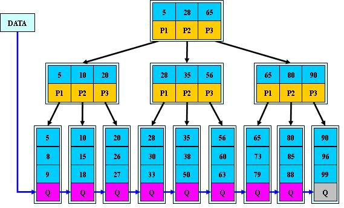

B-树的特性：

       1.关键字集合分布在整颗树中；

       2.任何一个关键字出现且只出现在一个结点中；

       3.搜索有可能在非叶子结点结束；

       4.其搜索性能等价于在关键字全集内做一次二分查找；

       5.自动层次控制；
      

B+的特性：

       1.所有关键字都出现在叶子结点的链表中（稠密索引），且链表中的关键字恰好是有序的；

       2.不可能在非叶子结点命中；

       3.非叶子结点相当于是叶子结点的索引（稀疏索引），叶子结点相当于是存储（关键字）数据的数据层；

       4.更适合文件索引系统；
       

B*树

       是B+树的变体，在B+树的非根和非叶子结点再增加指向兄弟的指针；
